

# 🎬 Demo Fitur — RT Administration System

Demonstrasi lengkap semua fitur aplikasi melalui screen recording.

[← Kembali ke README](./README.md)

---

## 🔐 Autentikasi

Login dan logout dengan sistem cookie berbasis Laravel Sanctum.

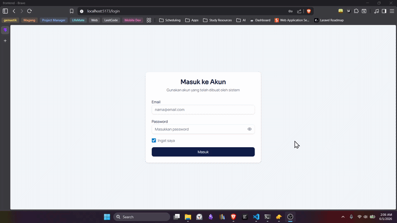

---

## 📊 Dashboard

Ringkasan statistik RT: total penghuni, rumah, tagihan tertunggak, dan saldo kas terkini.

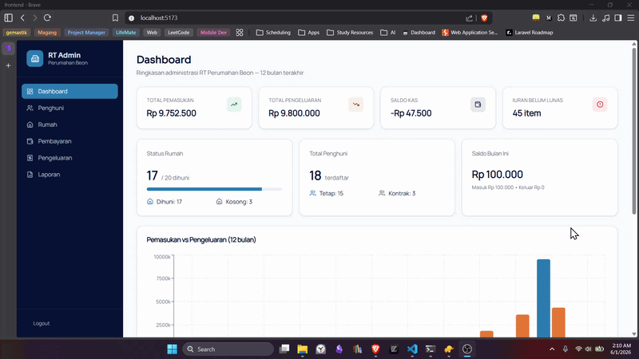

---

## 👤 Manajemen Penghuni

### Tambah Penghuni Baru

Formulir pendataan penghuni lengkap dengan upload foto KTP.

### Detail & Histori Penghuni

Lihat profil lengkap penghuni beserta riwayat pembayaran.

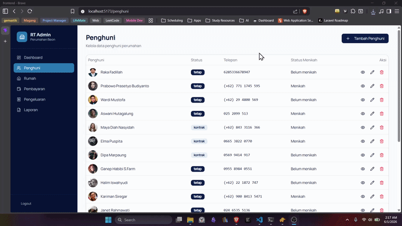

### Edit & Hapus Penghuni

Perbarui data atau hapus penghuni dari sistem.

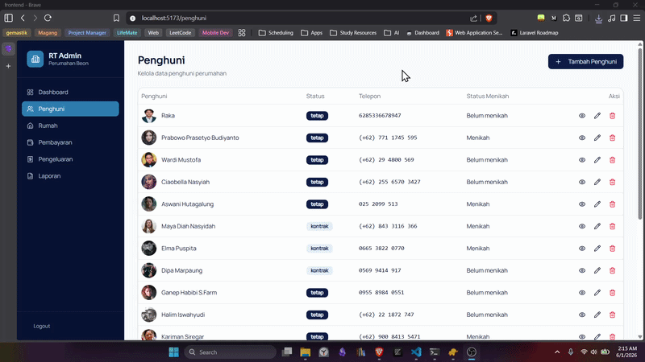

---

## 🏠 Manajemen Rumah

### Tambah Rumah Baru

Daftarkan unit rumah baru dengan nomor blok.

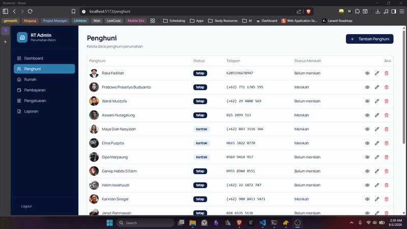

### Detail Rumah & Unassign Penghuni

Lihat penghuni aktif, histori hunian, tagihan terkait, dan kelola assignment hunian.

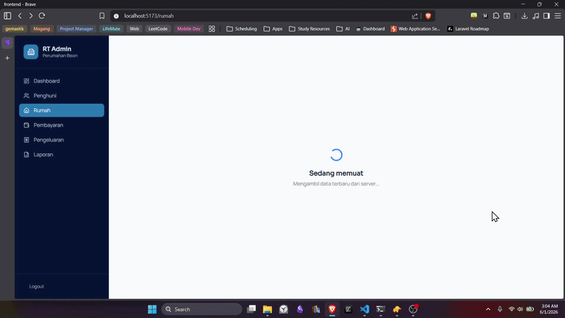

---

## 💰 Pembayaran & Tagihan

### Lihat Tagihan & Tambah Tagihan

Daftar tagihan per rumah berdasarkan jenis iuran dan periode, serta cara menambahkan tagihan baru.

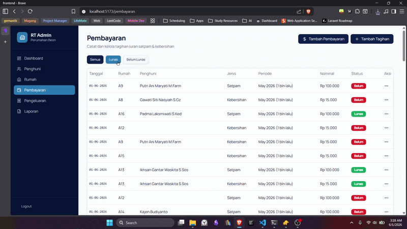

### Catat Pembayaran

Proses pembayaran iuran dengan alokasi ke tagihan yang belum lunas.

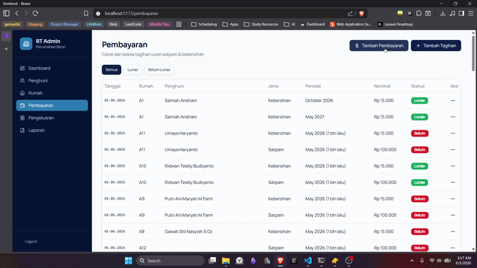

### Edit & Hapus Pembayaran

Koreksi atau hapus transaksi pembayaran yang sudah dicatat.

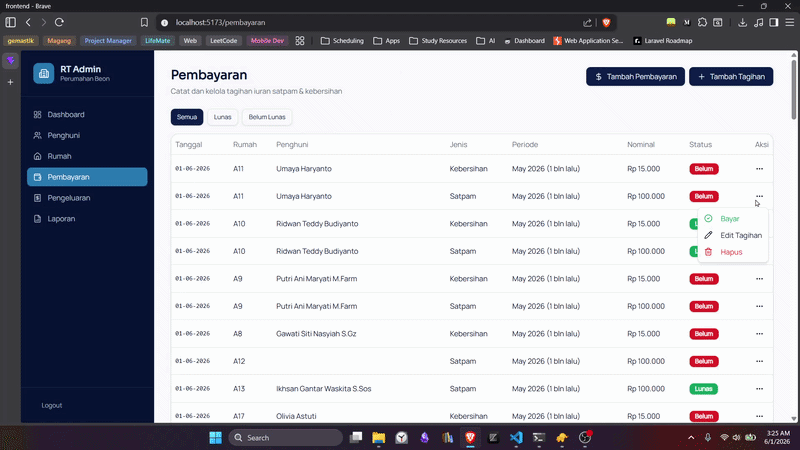

---

## 🧾 Pengeluaran

### Tambah Pengeluaran

Catat pengeluaran kas RT berdasarkan kategori.

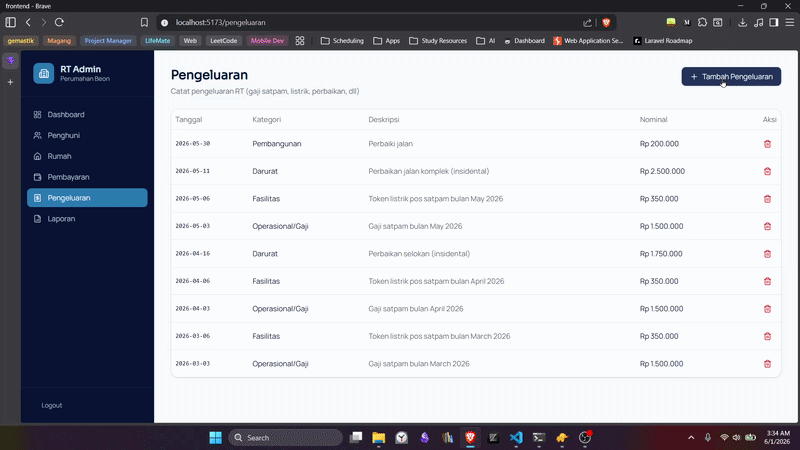

### Hapus Pengeluaran

Hapus pengeluaran yang salah input.

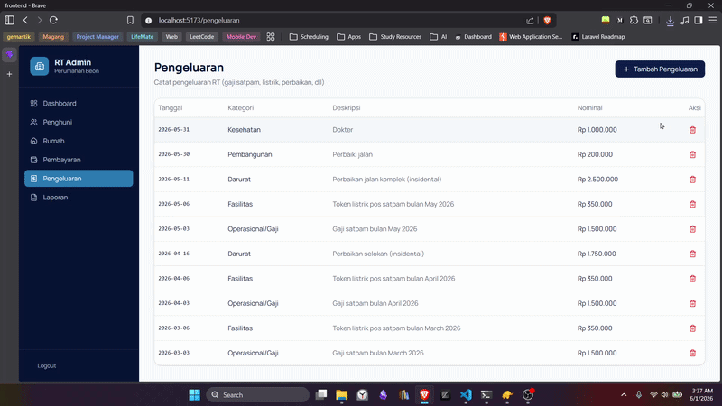

---

## 📈 Laporan Keuangan

Ringkasan pemasukan, pengeluaran, dan saldo kas RT dalam rentang periode tertentu.

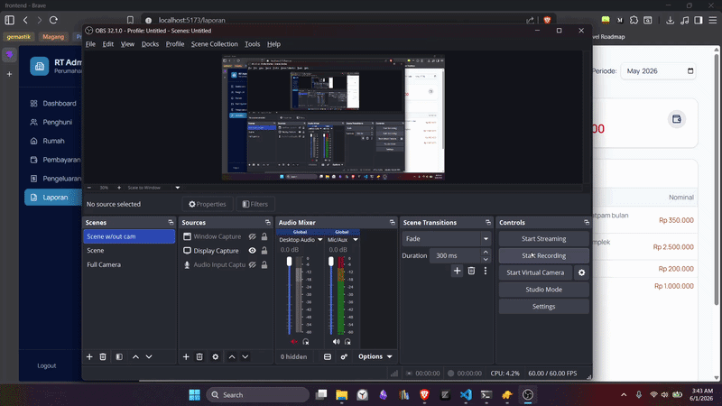

---

[← Kembali ke README & Panduan Instalasi](./README.md)

