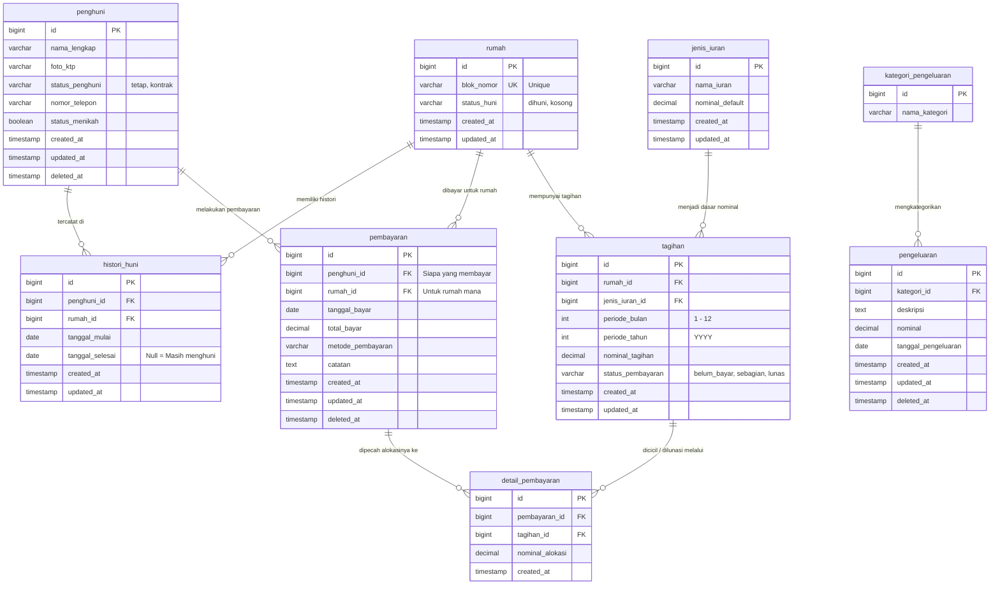

<div align="center">

# 🏘️ RT Administration System

**Sistem administrasi RT modern — dari pencatatan penghuni hingga laporan keuangan, semua dalam satu platform.**

[](https://laravel.com)
[](https://react.dev)
[](https://typescriptlang.org)
[](https://mysql.com)

[🎬 Lihat Demo Fitur](./FEATURES.md) · [📐 ERD Diagram](#-erd-diagram) · [🚀 Mulai Instalasi](#-instalasi)

</div>

---

## ✨ Tentang Proyek

RT Administration System adalah aplikasi fullstack untuk membantu pengurus RT mengelola data warga dan keuangan secara digital. Tidak perlu lagi buku catatan manual atau spreadsheet yang berantakan.

**Apa yang bisa dilakukan:**

- 👤 **Manajemen Penghuni** — Catat data warga, status hunian, dan histori pindah masuk/keluar
- 🏠 **Manajemen Rumah** — Kelola blok rumah, assign/unassign penghuni
- 💰 **Sistem Tagihan & Pembayaran** — Buat tagihan iuran bulanan, catat pembayaran, lacak tunggakan
- 📊 **Laporan Keuangan** — Ringkasan pemasukan, pengeluaran, dan saldo kas RT
- 🔐 **Autentikasi Aman** — Login berbasis cookie dengan Laravel Sanctum

> 🎬 **[Lihat demo GIF semua fitur →](./FEATURES.md)**

---

## 🛠️ Teknologi

| Layer | Stack |
|-------|-------|
| **Backend** | PHP 8.2+, Laravel 12, MySQL 8, Laravel Sanctum |
| **Frontend** | React, Vite, TypeScript, Tailwind CSS, shadcn/ui |
| **State & Data** | TanStack Query, Zustand, Axios |
| **Routing** | React Router DOM |

---

## 📐 ERD Diagram



---

## 📁 Struktur Proyek

```
rt-management-app/
│
├── README.md                   ← Kamu di sini
├── FEATURES.md                 ← Demo GIF semua fitur
├── component-diagram.png
│
├── backend/                    ← Laravel API
│   ├── app/
│   │   ├── Http/
│   │   │   ├── Controllers/    ← Terima request, panggil Service, kembalikan JSON
│   │   │   ├── Requests/       ← Validasi input dari user
│   │   │   └── Resources/      ← Format response JSON sebelum dikirim ke frontend
│   │   ├── Models/             ← Eloquent ORM & relasi antar tabel
│   │   └── Services/           ← Business logic kompleks (kalkulasi tagihan, laporan)
│   ├── database/
│   │   ├── migrations/         ← Skema tabel database
│   │   └── seeders/            ← Data awal / dummy
│   ├── routes/                 ← Definisi endpoint API
│   └── storage/app/public/     ← File upload dari frontend
│
└── frontend/                   ← React + Vite
    └── src/
        ├── assets/             ← Gambar, ikon, font statis
        ├── components/         ← UI components global (Button, Modal, dll)
        ├── features/           ← Fitur dikelompokkan per domain
        │   ├── auth/           ← api/, components/, hooks/, routes/, types/
        │   ├── penghuni/
        │   ├── rumah/
        │   ├── pembayaran/
        │   └── ...
        ├── layouts/            ← Komponen layout
        ├── lib/                ← Konfigurasi library shared
        ├── pages/              ← Gerbang masuk page
        ├── routes/             ← React Router (createBrowserRouter)
        ├── store/              ← Zustand client-state
        ├── App.tsx             ← Root component (QueryClientProvider, RouterProvider)
        └── main.tsx            ← Vite entry point
```

---

## 🚀 Instalasi

### Persyaratan Sistem

| Software | Versi Minimum |
|----------|---------------|
| PHP | 8.2 |
| Composer | Latest |
| Node.js | 20.x |
| npm | 10.x |
| MySQL | 8.x |
| Git | Latest |

```bash
# Cek versi yang terinstall
php -v && composer -V && node -v && npm -v && mysql --version
```

### 1. Clone Repository

```bash
git clone <repository-url>
cd rt-management-app
```

### 2. Setup Backend (Laravel)

```bash
cd backend

# Install dependencies
composer install

# Buat file environment
cp .env.example .env          # Linux/macOS
copy .env.example .env        # Windows

# Generate application key
php artisan key:generate
```

**Konfigurasi `.env`:**

```env
DB_CONNECTION=mysql
DB_HOST=127.0.0.1
DB_PORT=3306
DB_DATABASE=rt_administration
DB_USERNAME=root
DB_PASSWORD=

SESSION_DRIVER=file
SANCTUM_STATEFUL_DOMAINS=localhost:5173,127.0.0.1:5173
CORS_ALLOWED_ORIGINS=http://localhost:5173,http://127.0.0.1:5173
```

```bash
# Jalankan migration + seeder
php artisan migrate:fresh --seed

# Buat storage link (untuk upload file)
php artisan storage:link

# Jalankan server
php artisan serve
# → http://127.0.0.1:8000
```

### 3. Setup Frontend (React)

```bash
cd frontend

# Install dependencies
npm install

# Buat file environment
echo "VITE_API_URL=http://localhost:8000/api/v1" > .env

# Jalankan dev server
npm run dev
# → http://localhost:5173
```

> **⚠️ Penting:** Gunakan `localhost` (bukan `127.0.0.1`) untuk keduanya agar cookie Laravel Sanctum terbaca dengan benar.

---

## 🔑 Akun Default

Setelah menjalankan seeder:

| Role | Email | Password |
|------|-------|----------|
| Admin | test@example.com | password |

---

## 📦 Build Production

**Backend:**
```bash
php artisan optimize   # cache config, route, view
```

**Frontend:**
```bash
npm run build
# Output: frontend/dist/
```

---

## 🔧 Troubleshooting

<details>
<summary><b>Composer install gagal</b></summary>

```bash
composer self-update
composer clear-cache
composer install
```
</details>

<details>
<summary><b>Error APP_KEY missing</b></summary>

```bash
php artisan key:generate
```
</details>

<details>
<summary><b>Error storage:link</b></summary>

```bash
php artisan storage:unlink
php artisan storage:link
```
</details>

<details>
<summary><b>Frontend tidak bisa terhubung ke API</b></summary>

Pastikan `VITE_API_URL` di `.env` frontend mengarah ke hostname yang sama dengan backend:
```env
VITE_API_URL=http://localhost:8000/api/v1
```
</details>

<details>
<summary><b>Error migration</b></summary>

```bash
php artisan migrate:fresh --seed
```
</details>

---

## 📋 Command Referensi

**Laravel:**
```bash
php artisan serve
php artisan migrate:fresh --seed
php artisan storage:link
php artisan optimize
php artisan test
```

**React + Vite:**
```bash
npm run dev
npm run build
npm run preview
```

---

<div align="center">

Dibuat dengan ❤️ untuk kemudahan administrasi warga RT

</div>
